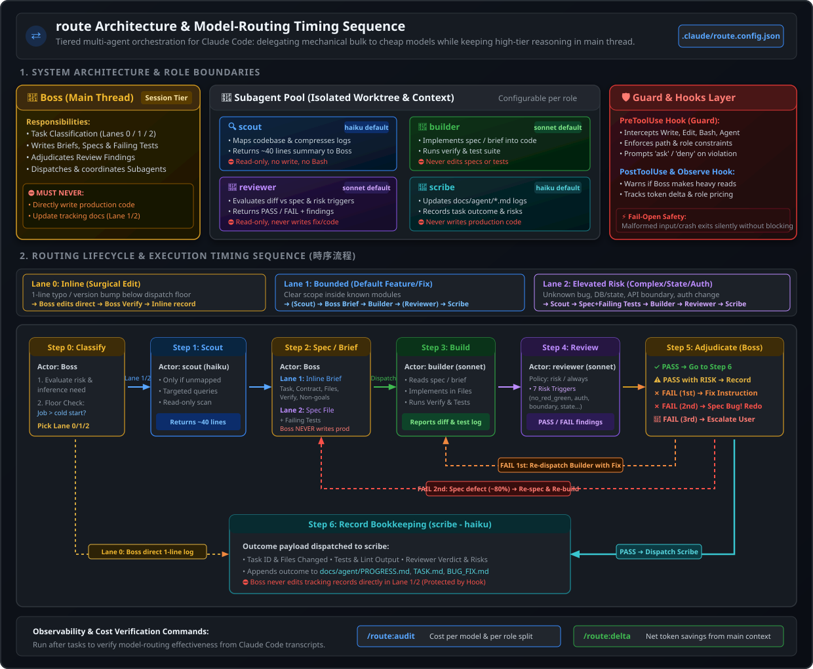

# route

A Claude Code plugin marketplace with one plugin, `route`: a model-routing loop that
keeps the expensive model out of mechanical work. The Boss runs in your main session;
four subagents do everything else.

| Role | Where it runs | Default model | Owns | Must never |
|---|---|---|---|---|
| **Boss** | the main thread | your session model | routing, sequencing, specs, adjudication | write production code or a tracking record |
| **scout** | subagent | haiku | mapping the codebase, compressing logs/stack traces | write anything, or run commands |
| **builder** | subagent | sonnet | implementing an existing spec | touch tests, specs, or tracking docs |
| **reviewer** | subagent | sonnet | reviewing a builder's diff against its spec | fix anything, propose a fix, or run commands |
| **scribe** | subagent | haiku | recording outcomes into the tracking docs | write production code |

Role boundaries are enforced by `PreToolUse` hooks where the path and role are
classifiable. The hook cannot inspect an inline brief's per-task `Files` list, Bash is
best-effort for roles that have Bash, and all hooks fail open on malformed input.

## Requirements

Python 3.8 or newer, with `python3` on `PATH`. No third-party packages — the hooks import
only the standard library.

## Install

```
/plugin marketplace add CTJ425/Model-Routing
/plugin install route@route
```

Then, in any target repo:

```
/route:init      # ask a few questions, write .claude/route.config.json
/route:config    # view or change which model each role uses in this project
```

## Architecture & Routing Sequence



### Routing Lifecycle & Timing Steps

The model-routing loop operates across 7 distinct steps with automated role boundary enforcement and adjudication loops:

```
[0. Classify Lane] ──► [1. Scout (Map)] ──► [2. Boss (Spec/Brief)] ──► [3. Builder (Code)]
                                                                               │
[6. Scribe (Record)] ◄── [5. Boss (Adjudicate)] ◄── [4. Reviewer (Risk Check)] ◄┘
         ▲                        │
         └──────── (Lane 0) ──────┴──► [Adjudication Loops: Fix / Re-spec / Escalate]
```

1. **Step 0 — Classify Lane & Dispatch Floor Check (`Boss`)**:
   - Evaluates risk, inference requirements, and checks if task size exceeds subagent cold-start overhead.
   - **Lane 0 (Inline Surgical)**: Single-line fixes/version bumps below dispatch floor. Boss edits directly, verifies, and records inline.
   - **Lane 1 (Bounded Feature/Fix)**: Standard changes inside known modules. Boss drafts an inline brief.
   - **Lane 2 (Elevated Risk)**: Complex bugs, state/DB changes, auth, API boundaries. Boss drafts a full spec file with failing tests.
2. **Step 1 — Codebase Mapping (`scout` | Haiku default)**:
   - Dispatched only when the target area is unmapped. Performs read-only scans and returns a concise ~40-line structural summary.
3. **Step 2 — Spec / Brief Authoring (`Boss` | Session Model)**:
   - High-tier model writes task contract, exhaustive `Files` list, verify command, and non-goals. Boss never writes production code.
4. **Step 3 — Implementation & Build (`builder` | Sonnet default)**:
   - Reads spec/brief, implements changes strictly within the specified file list, and runs verification and test commands.
5. **Step 4 — Review & Trigger Evaluation (`reviewer` | Sonnet default)**:
   - Triggered based on `review.policy` (`always`, `risk`, `never`). Evaluates diff against 7 risk triggers (`no_red_green`, `persistent_state`, `authorization`, `boundary`, `silent_calculation`, `control_flow`, `builder_blocker`).
6. **Step 5 — Adjudication & Feedback Loops (`Boss` | Session Model)**:
   - **PASS**: Proceeds to Step 6.
   - **FAIL (1st time)**: Boss writes targeted fix instructions (file + line + post-condition) and re-dispatches `builder`.
   - **FAIL (2nd time)**: Defect is in the spec (~80% probability). Boss fixes spec and restarts build.
   - **FAIL (3rd time)**: Halts loop and escalates to the user.
7. **Step 6 — Bookkeeping & Audit Logging (`scribe` | Haiku default)**:
   - Appends verified outcome, test counts, lint results, reviewer verdicts, and risks to `docs/agent/PROGRESS.md`, `TASK.md`, and `BUG_FIX.md`.

Load the `route` skill (or just start a feature or bug — the SessionStart hook reminds
the session it delegates) and it walks this loop step by step, including when to skip a
step for a small change.

## Per-project configuration

Each project gets its own `.claude/route.config.json`. Every key is optional; the hooks
deep-merge it over their defaults, and `schema/route.config.schema.json` documents the
full shape.

```json
{
  "version": 2,
  "paths": { "prod": ["src/"] },
  "models": { "scout": "haiku", "builder": "sonnet", "reviewer": "sonnet", "scribe": "haiku" },
  "bookkeeping": { "enabled": true, "timezone": "UTC" },
  "review": { "policy": "risk" }
}
```

- `paths.prod` — repo-relative prefixes and globs the guard treats as production code.
- `models.<role>` — overrides that role's agent-file default for this project only,
  passed as a per-dispatch model override. Editing this file never touches the plugin's
  own `agents/*.md`, so a plugin update cannot silently undo a project's tuning. Note
  that the `CLAUDE_CODE_SUBAGENT_MODEL` environment variable, if set, outranks it.
- `bookkeeping.enabled` — set `false` for model routing only: no `scribe`, no tracking
  docs, no record rules in the guard.
- `review.policy` — the Boss's review-routing policy: `always`, `risk` (default), or
  `never`. The PostToolUse nudge makes a required review visible but does not itself block
  a user or model that ignores it.
- `review.triggers` — optional IDs replacing the default risk checks:
  `no_red_green`, `persistent_state`, `authorization`, `boundary`,
  `silent_calculation`, `control_flow`, and `builder_blocker`.

`/route:init` writes the initial file; `/route:config` edits it.

## Verifying it actually routed

```
/route:doctor    # is the plugin live, and is it configured so the roles can work
/route:audit     # cost per model and per role, main thread and subagents
/route:delta     # whether each dispatch removed net tokens from main's context
```

`/route:doctor` runs first when something looks wrong. It answers the one question the other
two cannot: whether the hooks are executing at all. It reports only — it repairs nothing.

Both read the transcripts Claude Code already writes. Read the per-role split, not the
token columns: one model and zero subagent transcripts means nothing was routed, whatever
the plan said. The USD columns come from `route/scripts/pricing.json`, which ships with
placeholder rates — check them against the official pricing page before quoting a number.

## What this does NOT enforce

- **Writes issued through Bash.** The guard's shell-command detection is a regex
  heuristic and it will never be complete. The real enforcement is the `tools:` allowlist:
  `scout` and `reviewer` have no Bash at all. For `builder` a suspected write raises an
  `ask`, because a shell command's target cannot be resolved reliably. Scribe's exact
  `cat >> <literal-path>` append inside `paths.docs` is allowed; other suspected writes ask.
  Balanced quoted spans are removed before the command is scanned, so `grep 'a -> b'` and
  `awk '$3 > 10'` are not mistaken for redirects — the cost of that is the mirror case: a
  write hidden entirely inside a quoted string, such as `bash -c 'echo x > f'`, is not
  detected. This guard catches accidents; it is not a sandbox.
- **Anything outside the project directory.** Paths that resolve outside the repo root
  are not classified and not policed.
- **Agents the plugin does not own.** An unrecognised `agent_type` passes every rule
  untouched; this guard governs the routing roles, not every agent in your repo.
- **Whether the model actually used its cheap tier.** The hooks record dispatches;
  `/route:audit` is what checks the bill.
- **The builder's inline `Files` list.** The guard enforces role-level path categories;
  the Builder and Reviewer must check the task-specific list.

Every guard is also fail-open by design: a malformed payload, an unreadable config, or a
crash in the hook exits silently rather than blocking your session.

That has one consequence worth knowing. The hooks are invoked as `python3`. If `python3`
does not resolve on the PATH Claude Code hands to hooks — a Windows box, or a pyenv/conda
interpreter that is not on it — every hook fails open and the plugin enforces nothing,
silently. **The `[routing]` brief at session start is the canary:** if you do not see it,
the hooks are not running, and neither are the guards. `/route:doctor` checks this directly —
a `FAIL` on `interpreter` or `hooks` means nothing described above is being enforced. Fix the
interpreter before trusting any of these boundaries.

## Language

Code, identifiers, and commit messages are English. Prose in records and agent reports
follows `language.artifacts` in the project config. This README is the documented
exception.

## License

MIT — see [LICENSE](LICENSE).
