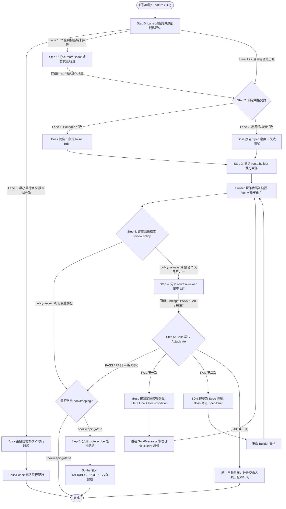
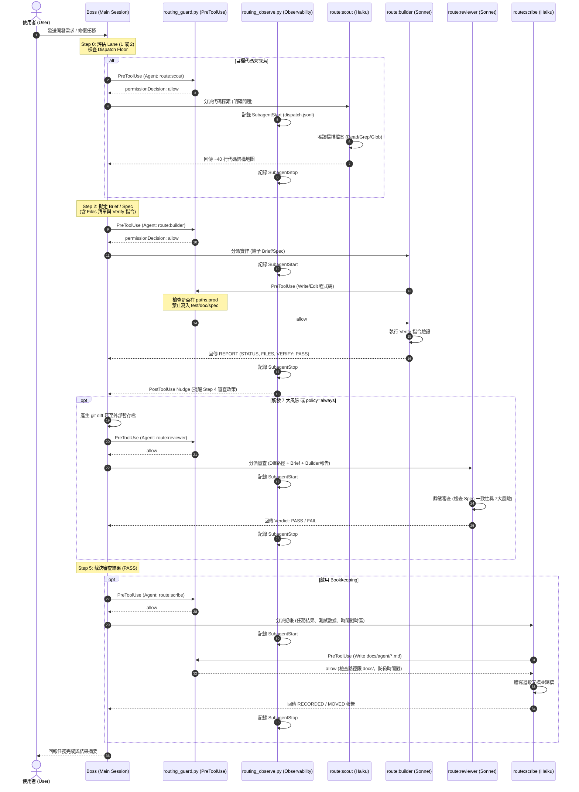
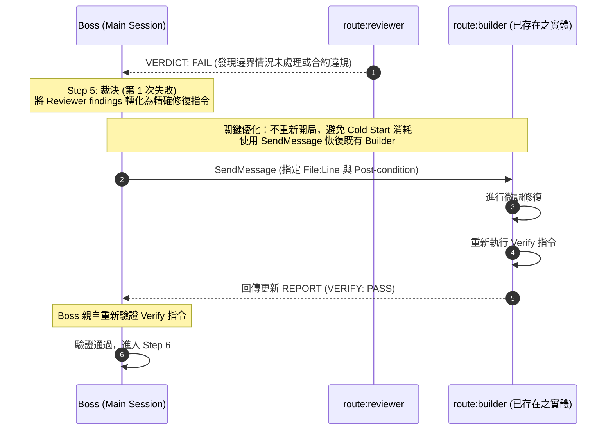
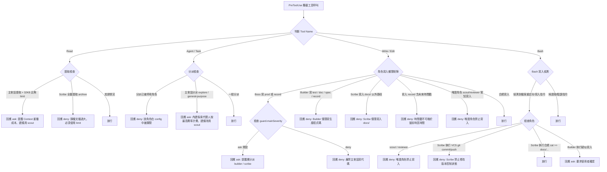

# Model-Routing (`route`) 系統架構與機制指南

> 本文件完整解析 `Model-Routing` (Claude Code `route` 插件) 的核心理念、分層多代理人架構、工作流生命週期、流程圖、時序圖、Hook 攔截防護機制與審計工具。

---

## 1. 核心理念與架構總覽 (System Overview)

### 1.1 核心問題：Context Replay 成本懲罰
在大語言模型 (LLM) 代理工作流中，**「重播上下文 (Context Replay)」** 是主會話費用的最大來源。
- 主會話（Main Thread / Boss）每讀取一個大檔案或執行一次全量日誌輸出，該內容將在後續的**每一個回合 (Turn)** 被重複計費。
- 讓高階昂貴模型（如 Claude 3.7 Sonnet / Opus）執行機械式的程式碼實作、檔案搜尋與文檔更新，會造成算力與費用的嚴重浪費。

### 1.2 解決方案：分層模型路由 (Tiered Model-Routing)
`route` 插件將任務拆解為「高階決策」與「機械執行」：
- **Boss（主會話）**：保留在高階模型，專注於任務分級、撰寫規格 (Spec/Brief)、編寫失敗測試 (Failing Tests)、結果裁決 (Adjudication)。**嚴禁撰寫生產程式碼與追蹤文檔**。
- **4 個專屬 Subagents**：將大量輸入留在子代理人內部，僅回傳高度壓縮的結果（如 ~40 行報告或結構化摘要），保持主會話 Context 輕量乾淨。

```
                    ┌─────────────────────────────────────────┐
                    │          Boss (主會話 / 高階模型)         │
                    │  • 任務分級 (Lanes)  • 撰寫 Spec / Brief │
                    │  • 撰寫失敗測試       • 裁決審查結果       │
                    └────┬──────────┬──────────┬──────────┬───┘
                         │          │          │          │
         ┌───────────────┘          │          │          └───────────────┐
         ▼                          ▼          ▼                          ▼
┌──────────────────┐  ┌──────────────────┐  ┌──────────────────┐  ┌──────────────────┐
│  route:scout     │  │  route:builder   │  │  route:reviewer  │  │  route:scribe    │
│  (Haiku - 唯讀)  │  │  (Sonnet - 實作) │  │  (Sonnet - 審查) │  │  (Haiku - 記帳)  │
│  • 代碼拓撲繪製  │  │  • 依 Spec 寫 Code│  │  • 比對 Diff/Spec│  │  • 謄寫 Task/Bug │
│  • 壓縮長 Log    │  │  • 執行 Verify    │  │  • 檢查 7大風險  │  │  • 歸檔與 Commit │
│  • 上限 40 行輸出│  │  • 嚴禁改測試/文件│  │  • 只報問題不提解│  │  • 嚴禁寫代碼    │
└──────────────────┘  └──────────────────┘  └──────────────────┘  └──────────────────┘
```

### 1.3 角色權限矩陣 (Role Matrix)

| 角色 (Role) | 執行位置 | 預設模型 | 負責範疇 (Owns) | 絕對禁止 (Must Never) | 具備工具 |
|---|---|---|---|---|---|
| **Boss** | Main Thread | Session Model (高階) | 路由分級、規格擬定、失敗測試、裁決判定 | 撰寫生產程式碼、直接編輯追蹤文檔 | 全工具 |
| **`scout`** | Subagent | Haiku | 代碼地圖繪製 (Map)、日誌與堆疊壓縮 (Compress) | 撰寫任何檔案、執行任何 Bash 指令 | `Read`, `Glob`, `Grep` |
| **`builder`** | Subagent | Sonnet | 依據 Spec/Brief 實作代碼、執行 Verify 驗證 | 變更測試檔案、修改 Spec、修改文檔 | `Read`, `Glob`, `Grep`, `Write`, `Edit`, `Bash` |
| **`reviewer`** | Subagent | Sonnet | 比對 Builder Diff 與 Spec，檢查 7 大風險觸發器 | 修復問題、提出修復建議方案、執行 Bash | `Read`, `Glob`, `Grep` |
| **`scribe`** | Subagent | Haiku | 機械化謄寫進度與成果至 `docs/agent/` 追蹤文件 | 撰寫生產代碼、推測數值、偽造時間戳 | `Read`, `Glob`, `Grep`, `Write`, `Edit`, `Bash` (限 `cat >>`) |

---

## 2. 核心工作流與流程圖 (Lifecycle & Flowcharts)

### 2.1 完整 7 階段路由生命週期 (Step 0 ~ Step 6)



### 2.2 詳細步驟解析

#### Step 0: 任務分級 (Lanes) 與冷啟動門檻 (Dispatch Floor)
Boss 依據推理需求、錯誤代價與主觀判斷進行分級：
- **Lane 0 (Inline Surgical)**：極微小修改（如錯字、版本升級、能用一句話描述的修改）。直接由 Boss 在主會話執行並驗證，避免子代理人冷啟動成本（約 $0.03+ 的系統 Prompt 與工具定義注入消耗）。
- **Lane 1 (Bounded Feature/Fix - 預設)**：已知模組內的邊界清晰任務。Boss 在 Prompt 內撰寫 5 段式 Inline Brief。
- **Lane 2 (Elevated Risk)**：未知原因 Bug、跨模組變更、持久化狀態/資料庫/認證變更。Boss 必須建立正式 Spec 檔案並預先編寫失敗測試。

#### Step 1: 代碼探索 (`route:scout` | Haiku)
- 僅在受影響代碼未被探索時分派。
- 嚴格限制輸出上限 **40 行**，標註 `ENTRY`, `DEFINES`, `CALLERS`, `STATE`, `TESTS`, `GAPS`。

#### Step 2: 規格制定 (`Boss`)
- **Lane 1 (Inline Brief)**：
  ```
  Task: <任務名稱與 ID>
  Contract: <輸入、輸出、錯誤處理、不變性承諾>
  Files: <窮舉允許修改的檔案清單，其餘檔案一律不准動>
  Verify: <完全精確的驗證指令>
  Non-goals: <明確禁止的額外行為>
  ```
- **Lane 2 (Spec File + Failing Tests)**：撰寫詳細規格文檔並在派工前完成測試失敗重現（Red-Green 基礎）。

#### Step 3: 程式碼實作 (`route:builder` | Sonnet)
- 嚴格只能修改 `Files` 清單中的檔案，禁止修改任何測試檔案與 `docs/`。
- 逐字執行 `Verify` 指令，確認回傳 `VERIFY: PASS`。

#### Step 4: 靜態審查與 7 大風險觸發器 (`route:reviewer` | Sonnet)
- Boss 將 `git diff` 輸出寫入**專案外部的暫存路徑**交給 Reviewer 比對（比閱讀全檔省下約 6.8x Token）。
- **7 大風險觸發器 (Risk Triggers)**：
  1. `no_red_green`：修改缺乏「原先失敗、修改後通過」的測試覆蓋。
  2. `persistent_state`：涉及跨進程生命週期的持久化狀態（DB、檔案、快取、佇列）。
  3. `authorization`：涉及權限控制與身分驗證邏輯。
  4. `boundary`：涉及外部系統依賴邊界（API 格式、CLI 參數、公開型別簽名）。
  5. `silent_calculation`：涉及計算錯誤但不會噴例外、只會默默產出錯誤數值的邏輯。
  6. `control_flow`：涉及流程控制、錯誤處理分支、重試機制、超時或並發行為。
  7. `builder_blocker`：Builder 於報告中主動提及阻礙 (`BLOCKERS`)。

#### Step 5: 裁決與修復閉環 (`Boss`)
- **PASS**：進入 Step 6。
- **FAIL 第一次**：Boss 撰寫包含 `檔案 + 行號 + 預期後置條件` 的精準指令，**透過 `SendMessage` 恢復 (Resume) 現有的 Builder**，避免重複載入系統提示詞的冷啟動開銷。
- **FAIL 第二次**：通常為規格設計瑕疵，Boss 修正 Spec 後重新開局。
- **FAIL 第三次**：停止迴圈，直接向使用者報錯升級。

#### Step 6: 機械記帳與審計 (`route:scribe` | Haiku)
- 將結果謄寫至 `docs/agent/`（`TASK.md`, `BUG_FIX.md`, `PROGRESS.md`）。
- 嚴守 **「先寫入目標歸檔 (Destination)，驗證後再刪除來源 (Source)」** 原則，避免中斷導致記錄遺失。

---

## 3. 時序圖 (Sequence Diagrams)

### 3.1 標準任務執行時序 (Standard Lane 1/2 Lifecycle)



### 3.2 審查失敗與 Builder 恢復迴圈 (Adjudication & Resume Sequence)



---

## 4. Hook 機制與安全防護系統 (Hook System Deep Dive)

整個 `route` 插件的行為約束與成本控制，核心建立於 Claude Code 的 Hook 生命週期機制上。

### 4.1 Hook 配置清單 (`route/hooks/hooks.json`)

```json
{
  "description": "Model-routing guards and observability for the route plugin",
  "hooks": {
    "SessionStart": [
      {
        "matcher": "",
        "hooks": [{ "type": "command", "command": "python3", "args": ["${CLAUDE_PLUGIN_ROOT}/hooks/routing_observe.py"] }]
      }
    ],
    "PreToolUse": [
      {
        "matcher": "Write|Edit|NotebookEdit|Agent|Task|Read",
        "hooks": [{ "type": "command", "command": "python3", "args": ["${CLAUDE_PLUGIN_ROOT}/hooks/routing_guard.py"] }]
      },
      {
        "matcher": "Bash",
        "hooks": [{ "type": "command", "command": "python3", "args": ["${CLAUDE_PLUGIN_ROOT}/hooks/routing_guard.py"] }]
      }
    ],
    "PostToolUse": [
      {
        "matcher": "Read|Grep|Glob",
        "hooks": [{ "type": "command", "command": "python3", "args": ["${CLAUDE_PLUGIN_ROOT}/hooks/routing_observe.py"] }]
      },
      {
        "matcher": "Agent|Task",
        "hooks": [{ "type": "command", "command": "python3", "args": ["${CLAUDE_PLUGIN_ROOT}/hooks/routing_observe.py"] }]
      }
    ],
    "SubagentStart": [
      { "matcher": "", "hooks": [{ "type": "command", "command": "python3", "args": ["${CLAUDE_PLUGIN_ROOT}/hooks/routing_observe.py"] }] }
    ],
    "SubagentStop": [
      { "matcher": "", "hooks": [{ "type": "command", "command": "python3", "args": ["${CLAUDE_PLUGIN_ROOT}/hooks/routing_observe.py"] }] }
    ],
    "SessionEnd": [
      { "matcher": "", "hooks": [{ "type": "command", "command": "python3", "args": ["${CLAUDE_PLUGIN_ROOT}/hooks/routing_observe.py"] }] }
    ]
  }
}
```

---

### 4.2 權限守衛系統：`PreToolUse` (`routing_guard.py`)

`routing_guard.py` 在工具執行前觸發，依據目前呼叫者的 `agent_type`（經過正規化為 `main`, `scout`, `builder`, `reviewer`, `scribe`）與目標路徑進行主動攔截：



#### 關鍵守衛邏輯與實作細節：
1. **路徑分類 (`classify`)**：
   - `spec`：`docs/agent/specs/*`
   - `record`：`TASK.md`, `BUG_FIX.md`, `PROGRESS.md` 及各自的 ARCHIVE
   - `doc`：`docs/agent/*`
   - `test`：`**/tests/**`, `**/*.test.*`, `**/test_*.py` 等
   - `prod`：`src/` 或自訂 production 路徑
   - `config`：`.claude/*`
2. **防偽時間戳檢驗 (`bad_stamps`)**：
   - 掃描 Markdown 寫入內容中的時間格式 (`YYYY-MM-DD HH:MM:SS`)。
   - 透過 `bookkeeping.timezone` 轉換當前時間，若時間戳超前當前時間超過 120 秒，判定為偽造或沿用舊草稿，直接拒絕 (`deny`)。
3. **Fail-Open 設計原則**：
   - 若 Payload 解析失敗、配置文件不存在或 Hook 本身發生未預期例外，**一律靜默退出 (Exit code 0)**，確保不會因為守衛異常而導致使用者的開發 Session 崩潰中斷。

---

### 4.3 可觀測性與動態提醒系統 (`routing_observe.py`)

`routing_observe.py` 負責統計數據、寫入稽核紀錄並在關鍵時機提供上下文輔助：

1. **`SessionStart` (注入 Brief 提示詞)**：
   - 動態讀取 `.claude/route.config.json`，在 Session 開始時自動將當前啟用角色清單、大檔案讀取閥值、以及未完成的 `task(s)` 與 `open bug(s)` 數量注入主會話上下文。
2. **`SubagentStart` / `SubagentStop` (稽核日誌)**：
   - 每當子代理人啟動或結束，自動將 timestamp、event、agent_type、agent_id、effort、session_id、transcript_path 寫入 `.claude/routing/dispatch.jsonl`（具備 5MB 自動滾動機制）。
3. **`PostToolUse (Read|Grep|Glob)` (探索洩漏警示)**：
   - 在主會話統計 `Read/Grep/Glob` 呼叫次數。
   - 當主會話探索次數累積超過 `guard.scoutAt`（預設 12 次）時，每隔 8 次發出警示：「主會話已執行 N 次高費率探索，若仍在理解代碼庫請改派 `route:scout`」。
4. **`PostToolUse (Agent|Task)` (審查政策提醒)**：
   - 當 `route:builder` 完成並返回時，Hook 立即根據 `review.policy` 檢查是否有 7 大風險特徵，並注入審查提醒，防止主會話遺漏審查步驟。
5. **`SessionEnd`**：
   - 清理當前 session 在 `.claude/routing/state/` 的計數器檔案。

---

## 5. 配置指南與輔助工具 (Configuration & CLI Tools)

### 5.1 專案配置結構 (`.claude/route.config.json`)

```json
{
  "version": 2,
  "paths": {
    "prod": ["src/"],
    "test": ["**/tests/**", "**/*_test.py", "**/*.test.ts"],
    "docs": "docs/agent",
    "specs": "docs/agent/specs"
  },
  "models": {
    "scout": "haiku",
    "builder": "sonnet",
    "reviewer": "sonnet",
    "scribe": "haiku"
  },
  "roles": {
    "scout": { "enabled": true },
    "builder": { "enabled": true },
    "reviewer": { "enabled": true },
    "scribe": { "enabled": true }
  },
  "bookkeeping": {
    "enabled": true,
    "timezone": "Asia/Taipei",
    "records": {
      "tasks":    { "hot": "TASK.md",     "archive": "TASK_ARCHIVE.md" },
      "bugs":     { "hot": "BUG_FIX.md",  "archive": "FIXED_BUG.md" },
      "progress": { "hot": "PROGRESS.md", "archive": "PROGRESS_ARCHIVE.md", "keep": 2 }
    }
  },
  "review": {
    "policy": "risk",
    "nudge": true,
    "triggers": [
      "no_red_green",
      "persistent_state",
      "authorization",
      "boundary",
      "silent_calculation",
      "control_flow",
      "builder_blocker"
    ]
  },
  "guard": {
    "mainSeverity": "ask",
    "readKB": 32,
    "scoutAt": 12,
    "bashWriteDetection": true
  }
}
```

### 5.2 內建指令工具

| 指令 (Slash Command) | 執行腳本 | 核心功能說明 |
|---|---|---|
| `/route:init` | 互動引導 | 引導使用者回答幾個關鍵問題，於當前目錄產生標準 `.claude/route.config.json` |
| `/route:config` | 設定管理 | 查看或修改各角色啟用狀態 (`roles.<role>.enabled`) 與模型配置 (`models.<role>`) |
| `/route:doctor` | `routing_doctor.py` | 診斷環境：檢查 `python3` 路徑、Hook 腳本完整性、路徑比對有效性（唯讀診斷，不修改專案） |
| `/route:audit` | `routing_audit.py` | 分析 Session 的 Token 消耗量與花費金額（拆分主會話與各子代理人角色） |
| `/route:delta` | `dispatch_delta.py` | 評估每一次 Subagent 分派是否真正為主會話淨節省了 Token（扣除冷啟動開銷） |
| `python3 roll_records.py` | `roll_records.py` | 以「先插入後刪除」的安全原子操作將溢出的完成項目自 hot 檔案搬移至 archive 檔案 |

---

## 6. 總結與最佳實踐 (Best Practices Summary)

1. **守住主會話 Context**：主會話只負責想（思考、分級、寫規格、裁決），凡需大範圍讀檔案、寫代碼、改文件一律交由 Subagent。
2. **小修改走 Lane 0**：如果修改僅有 1~2 行且驗證方式明確，直接由主會話修改，避免支付 Subagent 的冷啟動底層費用。
3. **善用 SendMessage 恢復 Builder**：審查未通過時，切勿重新開局分派新 Builder，應針對既有 Builder 下達修復指令續做。
4. **尊重 7 大風險觸發器**：在 `review.policy=risk` 下，只要涉及狀態、授權、介面或無 Red-Green 測試，務必由 `route:reviewer` 進行獨立靜態審查。
